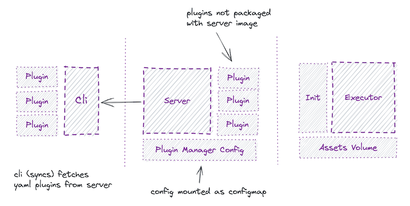

- Feature Name: Simplify Plugins
- Status: Draft
- Start Date: 2022-05-07
- Author: Saikumar

# Summary

The scope of this rfc is to simplify the release and deployment operations w.r.t the optimus plugin ecosystem.

The proposal here is to :
1. **Avoid Wrapping Executor Images** :   
Decouple the executor_boot_process and the executor as separate containers where the airflow worker launches a pod with init-container (for boot process) adjacent to executor container.
2. **Simplfy Plugin Installation** :
    - `Server end` : Install plugins on-demand declaratively instead of manually baking them into the optimus server image (in kubernetes setup).
    - `Client end` : Plugin interface for client-end is limited to support  Version, Survey Questions and Answers etc. that can be extracted out from the current plugin interface and maintained as yaml file which simplifies platform dependent plugin distribution for cli.
# Technical Design
## Background :
### Changes that trigger a new release in Optimus setup:
* Executor Image changes
* Executor Image Wrapper changes
* Plugin binary changes
* Optimus binary changes

### Release dependencies as per current design
* `Executor Image release` -> `Executor Wrapper Image release` -> `Plugin binary release` -> `Server release`
* `Plugin binary release` -> `Server release`

### 1. <u>Avoid Wrapping Executor Images</u>  : 
* The `executor_boot_process` and `executor` are coupled:
```
-- Plugin repo structure
/task/
/task/Dockerfile           -- task_image
/task/executor/Dockerfile  -- executor_image
```

Executor Wrapper Image (Task Image) :
- It's a wrapper around the executor_image to facilitate boot mechanism for executor.
- The optimus binary is downloaded during buildtime of this image.
- During runtime, it does as follow :
    - Fetch assets, secrets, env from optimus server.
    - Load the env and launches the executor process.

```
task_image 
    | executor_image
    | optimus-bin
    | entrypoint.sh (load assets, env and launch executor)
```

The `optimus-bin` and `entrypoint.sh` are baked into the `task_image` and is being maintained by task/plugin developers.

### 2. <u>Simplify Plugin Installation</u> : 
* Plugin binaries are manually installed (baked into optimus image in kubernetes setup). 
* Any change in plugin code demands re-creation of optimus image with new plugin binary, inturn demanding redeployment of optimus server. (in kubernetes setup)
* At client side, plugin binaries require support for different platforms.

## Approach :
### 1. <u>Avoid Wrapping Executor Images </u> :
* Decouple the lifecycle of the executor and the boot process as seperate containers/images.

<!--  -->


**Task Boot Sequence**:
1. Airflow worker fetches env and secrets for the job and adds them to the executor pod as environment variables.
2. KubernetesPodOperator spawns init-container and executor-container, mounted with shared volume (type emptyDir) for assets.
3. `init-container` fetches assets, config, env files and writes onto the shared volume.
4. the default entrypoint in the executor-image starts the actual job.


### 2. <u>Simplify Plugin Installations</u> :


#### A) Plugin Manager: (at server end)
+ Currently the plugins are maintained as mono repo and internally versioned i.e., version of plugin are mainatined within each plugin.
+ A plugin manager is required to support declarative installation of plugins.
+ This plugin manager consumes a config (plugin_manager_config) and downloads artifacts from a plugin repository.
* Optimus support for plugin manager as below.
    *  `optimus plugin install -c optimus.yaml` -- server
    *  `optimus plugin sync -c optimus.yaml` -- cli
    *  `optimus plugin list`
* Support for different kinds of plugin repositories (like s3, gcs, url, local file system etc..) gives the added flexibility and options to distribute and install the plugin binaries in different ways.
* Plugins are installed at container runtime and this decouples the building of optimus docker image from plugins installations. The plugin_manager_config can be maintained as `ConfigMap` so as to reflect any updates in plugins all one needs to do is change in the config map and restart the pod. 
* Example for the plugin config: 
```yaml
    plugins :
      plugin_dir : ""
      providers :
      - type : http
        name : internal_url_xyz_org
        url: http://<internal_url>
        auth: 
      - type : gcs
        name : private_gcs_backend_team
        bucket: <bucket>
        service_account : <base64_encoded_service_account>
      plugins :
      - provider : internal_url_xyz_org
        path : <plugin_name>.tar.gz
      - provider : private_gcs_backend_team
        path : <plugin_name>.zip
        .
        .
      
 ```
#### B) Plugin Yaml Interface: (for client side simplification)
+ Currently plugins are implemented and distributed as binaries and as clients needs to install them, it demands support for different host  architectures.
+ Since CLI (client side) plugins just require details about plugin such as Version, Suevery Questions etc. the proposal here is to maintain CLI plugins as yaml files.
+ Implementation wise, the proposal here is to split the current plugin interface (which only supports interaction with binary plugins) to also accommodate yaml based plugins.
+ The above mentioned pluign manager, at server end, would be agnostic about the contents of plugin artifacts from the repository.
+ At client side, the CLI could sync the yaml files from the server itself to stay up-to-date with the server wrt plugins.
* Example representation of the yaml plugin : 
```yaml
  Name: bq2bq
  Version: latest
  Image: docker.io/odpf/optimus-task-bq2bq
  Description: "BigQuery to BigQuery transformation task"
  Questions:
    - Name:    "Project"
      Prompt:  "Project ID"
      Help:    "Destination bigquery project ID"
    - Name:
      .
      .
      .
  DefaultConfig:
    - name: PROJECT
      value: ''
    - name: TABLE
      value: ''

  DefaultAssets:
    - name: query.sql
      value: |
        -- SQL query goes here
        -- Select * from "project.dataset.table"
      
 ```
## Result:


* Executor boot process is standardised and extracted away from plugin developers. Now any arbitrary image can be used for executors.
* At server side, for changes in plugin (dur to plugin release), update the plugin_manager_config and restart the optimus server pod. The plugin manager is expected to reinstall the plugins.
* Client side dependency on plugins is simplified with yaml based plugins.


